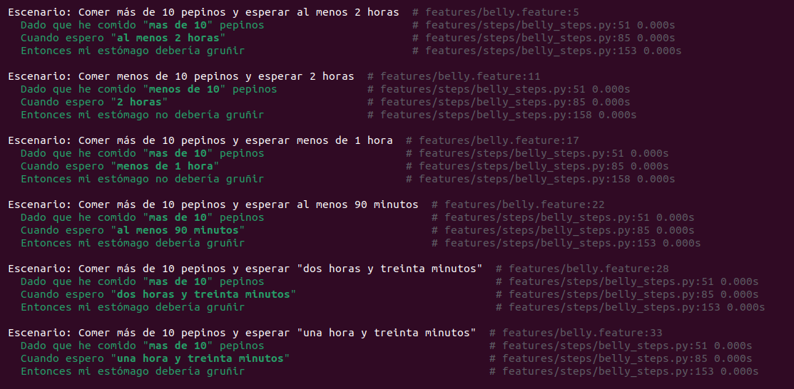
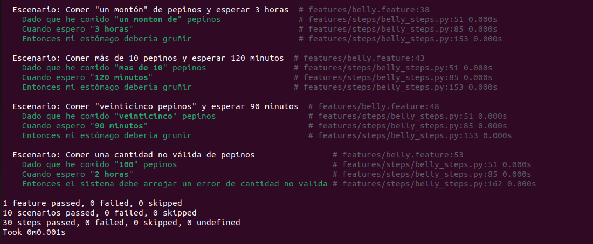
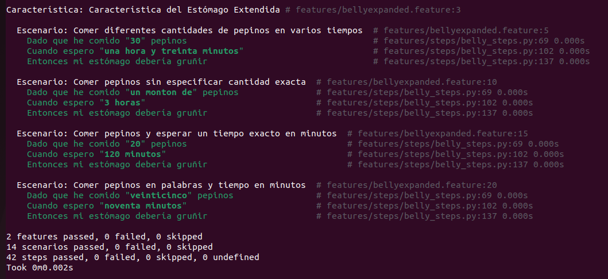
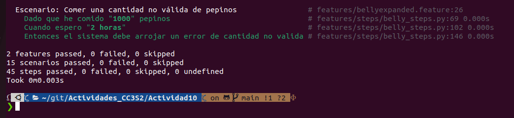
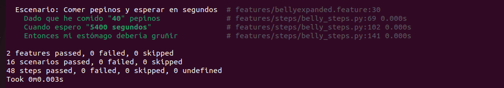
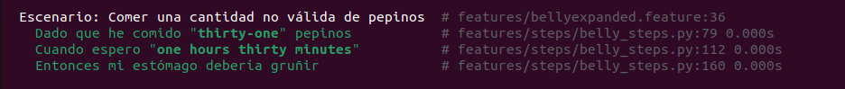
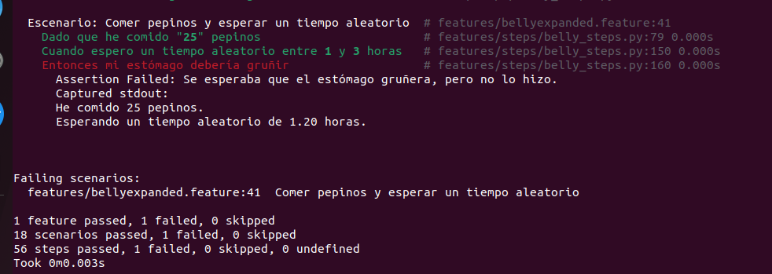
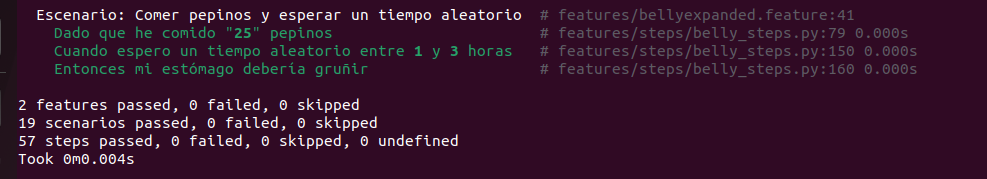
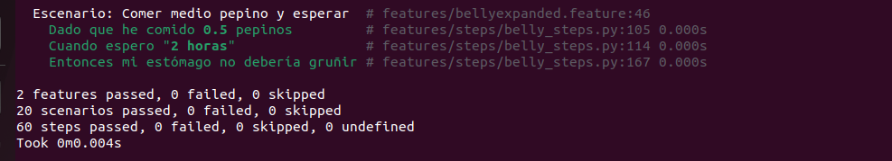

<h1>BDD con Behave y Gherkin</h1>
Las historias de  usuario y criterios de aceptacion que se usaran inicialmente son los siguientes:


<h2>Historia de usuario 1: Comer muchos pepinos y esperar el tiempo suficiente</h2>

- **Como** una persona que ha comido una cantidad considerable de pepinos,  
- **Quiero** que mi estómago comience a gruñir después de esperar al menos 2 horas,  
- **Para** saber si he comido lo suficiente para sentirme lleno y detectar cuando he comido en exceso.

**Criterios de aceptación**:  
- **Dado** que he comido más de 10 pepinos,  
- **Cuando** espero al menos 2 horas,  
- **Entonces** mi estómago debería gruñir.

<h2>Historia de usuario 2: Comer pocos pepinos y no gruñir</h2>

- **Como** una persona que ha comido una pequeña cantidad de pepinos,  
- **Quiero** que mi estómago no gruña si no he comido lo suficiente,  
- **Para** saber que aún no he comido lo necesario para sentirme lleno.

**Criterios de aceptación**:  
- **Dado** que he comido menos de 10 pepinos,  
- **Cuando** espero 2 horas,  
- **Entonces** mi estómago no debería gruñir.

<h2>Historia de usuario 3: Comer muchos pepinos y esperar menos de una hora</h2>

- **Como** una persona que ha comido muchos pepinos,  
- **Quiero** que mi estómago no gruña si no he esperado el tiempo suficiente,  
- **Para** saber que todavía no es el momento adecuado para sentirme lleno.

**Criterios de aceptación**:  
- **Dado** que he comido más de 10 pepinos,  
- **Cuando** espero menos de 1 hora,  
- **Entonces** mi estómago no debería gruñir.

<h2>Historia de usuario 4: Comer pepinos y esperar en minutos</h2>

- **Como** una persona que ha comido una cantidad moderada de pepinos,  
- **Quiero** que mi estómago gruña si he esperado el tiempo equivalente a al menos 1.5 horas, aunque lo exprese en minutos,  
- **Para** tener la flexibilidad de medir el tiempo de espera en minutos.

**Criterios de aceptación**:  
- **Dado** que he comido más de 10 pepinos,  
- **Cuando** espero al menos 90 minutos,  
- **Entonces** mi estómago debería gruñir.

<h2>Historia de usuario 5: Comer pepinos y esperar en diferentes formatos de tiempo</h2>

- **Como** una persona que ha comido una cantidad moderada de pepinos,  
- **Quiero** que mi estómago gruña si he esperado el tiempo suficiente, incluso cuando el tiempo de espera se exprese en formatos complejos como "dos horas y treinta minutos",  
- **Para** tener la flexibilidad de usar diferentes formatos de tiempo.

**Criterios de aceptación**:  
- **Dado** que he comido más de 10 pepinos,  
- **Cuando** espero "dos horas y treinta minutos",  
- **Entonces** mi estómago debería gruñir.

<h2>Nuevas historias de usuario (Extensiones)</h2>

<h2>Historia de usuario 6: Comer diferentes cantidades de pepinos y esperar en varios tiempos</h2>

- **Como** una persona que ha comido una cantidad moderada de pepinos,  
- **Quiero** que mi estómago gruña si he esperado un tiempo razonable (por ejemplo, "una hora y treinta minutos"),  
- **Para** que el sistema pueda manejar distintos tiempos de espera expresados en diferentes combinaciones.

**Criterios de aceptación**:  
- **Dado** que he comido más de 10 pepinos,  
- **Cuando** espero "una hora y treinta minutos",  
- **Entonces** mi estómago debería gruñir.

<h2>Historia de usuario 7: Comer pepinos sin especificar una cantidad exacta</h2>

- **Como** una persona que ha comido pepinos, pero sin especificar una cantidad exacta (por ejemplo, "un montón"),  
- **Quiero** que mi estómago gruña si he esperado un tiempo razonable,  
- **Para** permitir más flexibilidad en la entrada de datos de cuántos pepinos he comido.

**Criterios de aceptación**:  
- **Dado** que he comido "un montón" de pepinos,  
- **Cuando** espero 3 horas,  
- **Entonces** mi estómago debería gruñir.

<h2>Historia de usuario 8: Comer pepinos y esperar un tiempo exacto en minutos</h2>

- **Como** una persona que ha comido una cantidad moderada de pepinos,  
- **Quiero** poder expresar el tiempo de espera en minutos exactos y que el sistema lo acepte (por ejemplo, 120 minutos),  
- **Para** tener más control sobre la forma en la que expreso el tiempo de espera.

**Criterios de aceptación**:  
- **Dado** que he comido más de 10 pepinos,  
- **Cuando** espero 120 minutos,  
- **Entonces** mi estómago debería gruñir.

<h2>Historia de usuario 9: Comer pepinos expresados en palabras y esperar el tiempo en minutos</h2>

- **Como** una persona que ha comido una cantidad moderada de pepinos expresada en palabras (por ejemplo, "veinticinco pepinos"),  
- **Quiero** que mi estómago gruña si he esperado un tiempo expresado en minutos,  
- **Para** combinar la flexibilidad de entrada tanto en palabras como en tiempos expresados numéricamente.

**Criterios de aceptación**:  
- **Dado** que he comido "veinticinco pepinos",  
- **Cuando** espero 90 minutos,  
- **Entonces** mi estómago debería gruñir.

<h2>Historia de usuario 10: Comer una cantidad no válida de pepinos</h2>

- **Como** una persona que ha ingresado una cantidad no válida de pepinos (por ejemplo, "mil pepinos"),  
- **Quiero** que el sistema me advierta si he ingresado una cantidad excesiva,  
- **Para** evitar errores en el sistema debido a entradas no realistas.

**Criterios de aceptación**:  
- **Dado** que he ingresado una cantidad no válida de pepinos,  
- **Cuando** espero cualquier cantidad de tiempo,  
- **Entonces** el sistema debería arrojar un error de cantidad no válida.


<h2>Usando el comando Behave</h2>






-Se puede observar que las 10 historias pasaran

<h2>Analizando el codigo</h2>

El primer script que analizaremos sera belly.py:

```shell
# src/belly.py
class Belly:
    def __init__(self):
        self.pepinos_comidos = 0
        self.tiempo_esperado = 0

    def reset(self):
        self.pepinos_comidos = 0
        self.tiempo_esperado = 0

    def comer(self, pepinos):
        print(f"He comido {pepinos} pepinos.")
        self.pepinos_comidos = pepinos

    def esperar(self, tiempo_en_horas):
        if tiempo_en_horas > 0:
            self.tiempo_esperado = tiempo_en_horas

    def esta_gruñendo(self):
        # Verificar que ambas condiciones se cumplan correctamente:
        # Se han esperado al menos 1.5 horas Y se han comido más de 10 pepinos
        if self.tiempo_esperado >= 1.5 and self.pepinos_comidos > 10:
            return True
        return False
    
    def cantidad_invalida(self):
        if self.pepinos_comidos > 50:
            return True
        return False

```

Definimos la clase belly, donde guardaremos los datos de la cantidad de pepinos comidos,  y el tiempo transcurrido, tambien añadiremos una funcion para verificar si el estomago esta gruñendo y una funcion para verificar si la cantidad es valida o no.

El siguiente script que analizaremos es belly.step:

```shell
from behave import given, when, then
from src.belly import Belly
import re

# Crear una instancia de Belly
belly = Belly()

#Funcion para verificar si lo ingresado es un numero

def isDigit(digit):
    if digit  is None or digit=='':
        return False    
    try:
        int(digit)
        return True
    except ValueError:
        return False


# Función para convertir palabras numéricas a números
# Función para convertir palabras numéricas a números
def convertir_palabra_a_numero(palabra):
    pattern=r'(\w*)\s*y*\s*(\w*)'
    match = re.search(pattern,palabra)
    numeros = {
        "uno" or "una" or "1": 1, "dos": 2, "tres": 3, "cuatro": 4, "cinco": 5,
"seis": 6, "siete": 7, "ocho": 8, "nueve": 9, "diez": 10, "once":11 , "doce":12,
"veinte": 20, "veintuno":21, "veintidos":22,
"veintitres":23, "veinticuatro":24, "veinticinco":25,"veintiseis":26,
"veintisiete":27,"veintioscho":28,"veintinueve":29,
    }
    
    numeros2 = {
        "uno" or "una" or "1": 1, "dos": 2, "tres": 3, "cuatro": 4, "cinco": 5,
"seis": 6, "siete": 7, "ocho": 8, "nueve": 9
    }

    numeros3 = {
 "treinta": 30, "cuarenta": 40, "cincuenta": 50,
"sesenta": 60, "setenta": 70, "ochenta": 80, "noventa": 90
    }
    
    num1= numeros.get(match.group(1),0)
    num2=numeros2.get(match.group(2),0)
    num3=numeros3.get(match.group(1),0)
    if num1==0 and num3==0:
        return 0
    elif num3==0 and num2==0:
        return num1
    elif num3!=0 and num2!=0:
        res=num3+num2
        return res
    elif num3!=0 and match.group(2)=='':
        return num3
    else:
        return 0

```

Esta primera parte del codigo empieza importando las clases given,when,then del modulo behave, tambien importaremos la clase Belly y la libreria re

Creamos una instancia de la clase Belly, llamada belly, y definimos las siguientes funciones que se utilizaran mas adelante:

-isDigit(digit): Esta funcion devolvera True si el valor pasado es del tipo int, de lo contrario retornara False, adicionalmente retornara un False si la cadena pasada esta vacia.

-convertir_palabra_a_numero(palabra): Esta funcion convertira el string palabra a un numero de tipo int. Se usara el patron <h3>(\w*)\s*y*\s*(\w*) </h3> 

para poder capturar los digitos cuando la palabra es compuesta como por ejemplo "treinta y cinco". Esta funcion solo convertira las palabras de los numeros del 1 al 99.

Tambien esta funcion devolvera 0 cuando se le pasa cadenas como "veintitres y cinco" o "uno y diez". Esto gracias a las condicionales.


```shell
@given('que he comido "{cantidad}" pepinos')
def step_given_comido_variable(context,cantidad):
    if 'un monton de' == cantidad:
        belly.comer(11)
        return 0
    pattern = re.compile(r'(?:al\smenos\s|menos\sde\s|mas\sde\s?)?(\w*\s?y?\s?\w*)?')
    match = pattern.match(cantidad.lower())
    print(match.group(0))
    if isDigit(match.group(1)):
        number_pepinos=match.group(1)
        if "mas de" in cantidad:
            belly.comer(int(number_pepinos)+1)
        elif "menos de" in cantidad:
            belly.comer(int(number_pepinos)-1)
        else:
            belly.comer(int(number_pepinos))  
    else:
        number_pepinos=convertir_palabra_a_numero(match.group(1))
        if int(number_pepinos)==0:
            raise ValueError(f"Nose pudo interpretar la cantidad de pepinos:{match.group(0)}")
        if "mas de" in cantidad:
            belly.comer(int(number_pepinos)+1)
        elif "menos de" in cantidad:
            belly.comer(int(number_pepinos)-1)
        else:
            belly.comer(int(number_pepinos))        


La siguiente parte del codigo de belly_steps.py que analizaremos sera la funcion step_given_comido_variable que tiene como decorador @given, este decorador se utiliza para conectar el paso given del archivo belly.feature.

La funcion definida toma el contexto junto con la variable dinamica cantidad. 

La primera accion que realiza es que si la cadena pasada es igual a 'un monton de' entonces se comera la cantidad de pepinos igual a 11.

La segunda accion que se realiza es definir un patron usando la libreria regex. El patron a usar en este caso es:

<h3>(?:al\smenos\s|menos\sde\s|mas\sde\s?)?(\w*\s?y?\s?\w*)?</h3>

Este patron tiene las siguientes partes: 

-(?:al menos\s)?: Es un grupo sin captura, que agrupara un grupo de la forma "al menos " de manera opcional. Esto quiere decir que si no se encuentra la cadena anterior entonces no se agrupara nada y se pasa al siguiente grupo.

-(\w*\s?y?\s?\w*): Este grupo capturara palabras de la forma "treinta y dos" ,"32",treinta". Es decir , capturara los numeros de 1 al 99 ya sea si lo escribimos en numero o en letras.

Luego usaremos el metodo  match=pattern.match(cantidad.lower())  para guardar los grupos capturados en la variable match. Por ejemplo si le pasamos "Treinta y dos" los grupos guardados son los siguientes: match.group(1) sera igual a "treinta"  , match.group(2) sera igual a "dos".

El patron agrupara las palabras al menos, mas de o menos de, pero no los guardara en nigun grupo. Por ello si por ejemplo "mas de" se encuentra en la cadena cantidad entonces agrupara esta palabra, pero no lo guardara en ningun grupo, si luego de la palabra 'mas de' se encuantra un numero, entonces recien lo capturara.

Si le pasamos cualquier tipo de palabra, guardara solo la primera palabra pasada. Esto se manejara en la funcion convertir_palabra_a_numero que si no se encuentra en el diccionario de esa clase entonces el valor devuelto sera igual a 0. Y si el numero de pepinos es igual a cero, el programa me lanzara un error.

Tenemos dos formas de pasar un numero, ya sea como digitos o como palabra. Si la cadena que se captura es un numero, pasara por la funcion isDigito() que nos devolvera True, en cambio si la cadena pasada es una palabra o esta vacia, la funcion isDigito() nos devolvera False.

En la condicional para saber si es un digito o no existe condicionales que preguntaran si la palabra mas de, menos de, al menos se encuentran en la cadena. Si se encuentra que 'mas de' se encuentra en la cadena entonces, se llamara a la funcion belly.comer pero el numero de pepinos pasados se aumentara en uno. Cuando es 'menos de' el numero de pepinos pasados sera disminuido en 1 y si se encuentra al menos, el numero de pepinos no cambiara.


```shell
@when('espero "{time_description}"')
def step_when_wait_time_description(context, time_description):
    # Expresión regular para encontrar horas y minutos en una descripción con palabras o números
    pattern = re.compile(r'(?:al\smenos\s|menos\sde\s|mas\sde\s?)?(?:(.*)\shoras?)?(?:\s*y?\s*)?(?:(.+)\sminutos?)?')
    match = pattern.match(time_description.lower())
    # Si se encuentra coincidencia, convertir palabras o números a horas y minutos
    if isDigit(match.group(1)) or isDigit(match.group(2)): 
        hours=int(match.group(1)) if isDigit(match.group(1)) else 0
        minutes=int(match.group(2))/60 if isDigit(match.group(2)) else 0
        if "mas de" in time_description:
            belly.esperar(hours + minutes +0.017)
        elif "menos de" in time_description:
            belly.esperar(hours + minutes-0.017)
        else: 
            belly.esperar(hours+minutes)
    else:
        hours_word = match.group(1) if match.group(1) else "0"
        minutes_word = match.group(2) if match.group(2) else "0"
        hours = convertir_palabra_a_numero(hours_word)
        minutes = convertir_palabra_a_numero(minutes_word)
        total_time_in_hours = hours + (minutes / 60)
        if total_time_in_hours ==0:
            raise ValueError(f"Nose pudo interpretar la cantidad de pepinos:{match.group(0)}")
        if "mas de" in time_description:
            belly.esperar(total_time_in_hours+0.017)
        elif "menos de" in time_description:
            belly.esperar(total_time_in_hours-0.017)
        else: 
            belly.esperar(hours+minutes)

```

El siguiente codigo a analizar es el decorador @when. Este decorador tiene como funcion a step_when_wait_time_description. El patron en esta ocasion es el siguiente:

<h3>(?:al\smenos\s|menos\sde\s|mas\sde\s?)?(?:(.*)\shoras?)?(?:\s*y?\s*)?(?:(.+)\sminutos?)?</h3>

El cual capturara las horas y los minutos que se les pase. Capturara cadenas como "diez horas y veinticinco minutos","10 horas", "al menos 10 horas", etc. Solo guardara en los grupos los numeros que esten antes de horas y minutos. El codigo es muy parecido al anterior, con la diferencia que ahora trabajaremos con una nueva variable minutos, que sera dividida entre 60 antes de ser añadido a belly.esperar().

```shell
# Entonces mi estómago debería gruñir
@then('mi estómago debería gruñir')
def step_then_belly_should_growl(context):
    assert belly.esta_gruñendo(), "Se esperaba que el estómago gruñera, pero no lo hizo."

# Entonces mi estómago no debería gruñir
@then('mi estómago no debería gruñir')
def step_then_belly_should_not_growl(context):
    assert not belly.esta_gruñendo(), "Se esperaba que el estómago no gruñera, pero lo hizo."

@then('el sistema debe arrojar un error de cantidad no valida')
def cantidad_no_valida(context):
    assert belly.cantidad_invalida(), "Cantidad invalida de pepinos"

```

La siguiente parte del codigo es el decorador @then. Este decorado tiene las siguientes funciones:

step_then_belly_should_grow: Se llamara a esta funcion cuando se le pase el texto 'mi estomago deberia gruñir'. Si belly.esta-gruñendo() es falso entonces devolvera un error de Assert. 

step_then_belly_should_not_growl(context): Se llamara a esta funcion cuando se le pase el texto 'mi estomago no deberia gruñir'. Si belly.esta-gruñendo() es verdadero entonces devolvera un error de Assert. 

cantidad_no_valida: Se llamara a esta funcion cuando se le pase el texto 'el sistema debe arrojar un error de cantidad no valida'. Si belly.cantidad_invalida() es falso entonces devolvera un error de Assert. Esta error ocurrira cuando la cantidad de pepinos sea mayor a 50 


<h2>1.Caracteristica del estomago extendida</h2>

Cuando le agregamos las escenarios de caracteristica de estomago extendido todos pasan.

```shell
  Característica: Característica del Estómago Extendida

    Escenario: Comer diferentes cantidades de pepinos en varios tiempos
        Dado que he comido "30" pepinos
        Cuando espero "una hora y treinta minutos"
        Entonces mi estómago debería gruñir

    Escenario: Comer pepinos sin especificar cantidad exacta
        Dado que he comido "un monton de" pepinos
        Cuando espero "3 horas"
        Entonces mi estómago debería gruñir

    Escenario: Comer pepinos y esperar un tiempo exacto en minutos
        Dado que he comido "20" pepinos
        Cuando espero "120 minutos"
        Entonces mi estómago debería gruñir

    Escenario: Comer pepinos en palabras y tiempo en minutos
        Dado que he comido "veinticinco" pepinos
        Cuando espero "noventa minutos"
        Entonces mi estómago debería gruñir

```




<h2>Casos de prueba con excepciones</h2>
El sistema no aceptara un numero tan grande de pepinos como por ejemplo 1000 pepinos.

```shell
    Escenario: Comer una cantidad no válida de pepinos
      Dado que he comido "1000" pepinos
      Cuando espero "2 horas"
      Entonces el sistema debe arrojar un error de cantidad no valida
```



<h2>Esperar en segundos</h2>

```shell
    Escenario: Comer pepinos y esperar en segundos
        Dado que he comido "40" pepinos
        Cuando espero "5400 segundos"
        Entonces mi estómago debería gruñir
```



<h2>Caso de pruebas con numeros en ingles</h2>

```shell
    Escenario: Comer una cantidad no válida de pepinos
      Dado que he comido "thirty-one" pepinos
      Cuando espero "one hours thirty minutes"
      Entonces mi estómago debería gruñir
```

Agremos en el diccionario los numeros en ingles para que los reconozca:

```shell
    numeros = {
        "uno": 1, "una":1 ,"dos": 2, "tres": 3, "cuatro": 4, "cinco": 5,
"seis": 6, "siete": 7, "ocho": 8, "nueve": 9, "diez": 10, "once":11 , "doce":12,
"trece":13,"catorce":14,"quince":15,"dieciseis":16,"diecisiete":17,"dieciocho":18,"diecinueve":19,
"veinte": 20, "veintuno":21, "veintidos":22,
"veintitres":23, "veinticuatro":24, "veinticinco":25,"veintiseis":26,
"veintisiete":27,"veintioscho":28,"veintinueve":29, 
"one": 1, "two": 2, "three": 3, "four": 4, "five": 5,
"six": 6, "seven": 7, "eight": 8, "nine": 9, "ten": 10,
"eleven":11,"twelve":12,"thirteen":13,"fourteen":14,"fifteen":15,"sixteen":16,"seventeen":17,
"eighteen":18,"nineteen":19,"twenty":20,"twenty-one":21,"twenty-two":22,"twenty-three":23,"twenty-four":24,
"twenty-five":25,"twenty-six":26,"twenty-seven":27,"twenty-eight":28,"twenty-nine":29,"thirty":30,"thirty-one":31,
"thirty-two": 32, "thirty-three": 33, "thirty-four": 34, "thirty-five": 35, "thirty-six": 36, 
"thirty-seven": 37, "thirty-eight": 38, "thirty-nine": 39, "forty": 40, "forty-one": 41, 
"forty-two": 42, "forty-three": 43, "forty-four": 44, "forty-five": 45, "forty-six": 46, 
"forty-seven": 47, "forty-eight": 48, "forty-nine": 49, "fifty": 50}

```

Y luego de pasar las pruebas:



<h2>Esperar un numero aleatorio de horas en un rango</h2>
```shell
    Escenario: Comer pepinos y esperar un tiempo aleatorio
        Dado que he comido "25" pepinos
        Cuando espero un tiempo aleatorio entre 1 y 3 horas
        Entonces mi estómago debería gruñir
```

Para poder manejar esta prueba agregaremos la siguiente funcion en el decorador @when.

```shell
#Tiempo Aleatorio
@when('espero un tiempo aleatorio entre {min_time:d} y {max_time:d} horas')
def step_when_wait_random_time(context, min_time, max_time):
    tiempo_aleatorio = random.uniform(min_time, max_time)
    print(f"Esperando un tiempo aleatorio de {tiempo_aleatorio:.2f} horas.")
    belly.esperar(tiempo_aleatorio)

```

Cuando hagamos el test de este escencario, se generara un numero aleatorio entre 1 y 3 para las horas. Dependiendo de este numero la prueba pasara o no.

Por ejemplo:



El test no paso pues el numero obtenido fue menor a 1.5 horas.

En cambio:



Si pasa el test pues el numero obtenido aleatoriamente fue mayor a 1.5.


<h2>Unidades fraccionarias de pepinos</h2>

```shell
    Escenario: Comer medio pepino y esperar
        Dado que he comido 0.5 pepinos
        Cuando espero "2 horas"
        Entonces mi estómago no debería gruñir
```

Se debe poder aceptar el escenario cuando se coma una cantidad fraccionario de pepinos, por lo cual se añadira la siguiente funcion debajo del decorador @given.

```shell
@given('que he comido {cantidad:f} pepinos')
def step_given_eaten_fractional_cukes(context, cantidad):
    belly.comer(cantidad)
```



<h2>Validaciones adicionales en belly.py</h2>