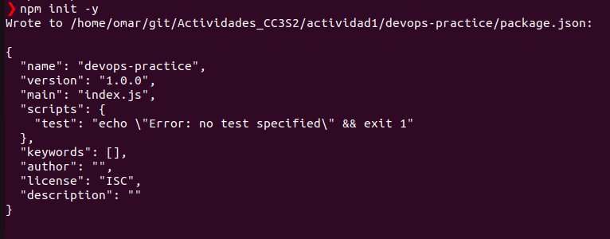

<h1>Aplicacion de los conceptos DevOps</h1>
<h2>Configuracion del entorno</h2>
Se va a crear una aplicacion web sencilla usando Node.js. Tendra una API REST basica con un unico endpointque devuelve un mensaje de "Hello,world!".
Iniciamos creando el directorio devops-practice usando el siguiente comando en ubuntu.

```shell
mkdir devops-practice
```

Luego cambiaremos de directorio a devops-practice, y dentro del directorio crearemos nuestro proyecto usando:

```shell
npm init -y
```



Instalamos las dependencias necesarias con el siguiente comando:

```shell
npm install express jest
```
Usando el comando anterior agregaremos los paquetes `express` y `jest` en nuestro proyecto. El paquete express nos permitira crear y gestionar rutas como tambien manejar solicitudes HTTPS,mientras que el paquete Jest es utilizado para pruebas unitarias y de integracion en aplicaciones Node.js.

Creamos los directorios src y test usando el siguiente comando:

```shell
mkdir src test
 ```

En el directorio src se guardara el codigo fuente y en el directorio test se almacenaran los archivos de pruebas que verifican el comportamiento del codigo.

Creamos los archivos app.js en el directorio src y el archivo app.test.js en el directorio test usando el siguiente comando.

```shell
touch src/app.js tests/app.test.js
 ```


Implementamos  la API REST en src/app.js

```shell
const express = require('express'); //Importa el modulo express
const app = express();//Crea una instancia de aplicacion express

//Creamos una solicitud get que devolvera el mensaje Hello World en la pagina web 
app.get('/', (req, res) => {
res.send('Hello, World!');
});

const port = process.env.PORT || 3000;//Establece el puerto donde la aplicacion escuchara a las solicitudes entrantes

//Inicia el servidor y lo pone a escuchar en el puerto indicado anteiormente
app.listen(port, () => {
console.log(Server running on port ${port});
});

module.exports = app//Exporta la instancia de la aplicacion app para que pueda  ser utilizada en otros archivos. 
 ```

Luego escribimos un test basico en tests/app.test.js:


```shell
const request = require('supertest');//Importa la libreria superTest la que se utiliza para simular solicitudes HTTPS
const app = require('../src/app');//Importa la aplicacion express desde el archivo app.js
//Define las pruebas relacionadas con GET
describe('GET /', () => {
    it('should return Hello, World!', async () => {
    const res = await request(app).get('/');
    expect(res.statusCode).toEqual(200);//Verifica que el codigo de estado HTTPS sea 200, lo cual nos indica que fue una solicitud exitosa
    expect(res.text).toBe('Hello, World!');//Verifica que el cuerpo de la respuesta sea Hello, World
    });
}); 
```

Configuramos el script de test en package.json


