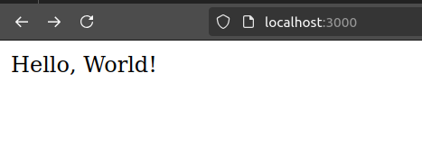

<h1>Aplicacion de los conceptos DevOps</h1>
<h2>Configuracion del entorno</h2>
Se va a crear una aplicacion web sencilla usando Node.js. Tendra una API REST basica con un unico endpointque devuelve un mensaje de "Hello,world!".
Iniciamos creando el directorio devops-practice usando el siguiente comando en ubuntu.

```shell
mkdir devops-practice
```

Luego cambiaremos de directorio a devops-practice, y dentro del directorio crearemos nuestro proyecto usando:

```shell
npm init -y
```


Creamos los directorios src y test usando el siguiente comando:

```shell
mkdir src test
 ```

En el directorio src se guardara el codigo fuente y en el directorio test se almacenaran los archivos de pruebas que verifican el comportamiento del codigo.

Creamos los archivos app.js en el directorio src y el archivo app.test.js en el directorio test usando el siguiente comando.

```shell
touch src/app.js tests/app.test.js
 ```


Implementamos  la API REST en src/app.js

```shell
const express = require('express'); //Importa el modulo express
const app = express();//Crea una instancia de aplicacion express

//Creamos una solicitud get que devolvera el mensaje Hello World en la pagina web 
app.get('/', (req, res) => {
res.send('Hello, World!');
});

module.exports = app//Exporta la instancia de la aplicacion app para que pueda  ser utilizada en otros archivos. 

if (require.main === module) {
    const port = process.env.PORT || 3000; 
    app.listen(port, () => {
        console.log(`Server running on port ${port}`);
    });
}

 ```


Luego escribimos un test basico en tests/app.test.js:


```shell
const request = require('supertest');//Importa la libreria superTest la que se utiliza para simular solicitudes HTTPS
const app = require('../src/app');//Importa la aplicacion express desde el archivo app.js
//Define las pruebas relacionadas con GET
describe('GET /', () => {
    it('should return Hello, World!', async () => {
    const res = await request(app).get('/');
    expect(res.statusCode).toEqual(200);//Verifica que el codigo de estado HTTPS sea 200, lo cual nos indica que fue una solicitud exitosa
    expect(res.text).toBe('Hello, World!');//Verifica que el cuerpo de la respuesta sea Hello, World
    });
}); 
```

Configuramos el script de test en package.json
```shell

{
"name": "devops-practice",
"version": "1.0.0",
"main": "index.js",
"scripts": {
"test": "jest"
},
"keywords": [],
"author":"",
"dependencies": {
"express": "^4.19.2",
"jest": "29.7.0"
},
"devDependencies": {
"supertest": "^7.0.0"
}
}

```

Dentro de nuestro archivo package.json podemos observar las dependencias express y jest. El paquete express nos permitira crear y gestionar rutas como tambien manejar solicitudes HTTPS,mientras que el paquete Jest es utilizado para pruebas unitarias y de integracion en aplicaciones Node.js.

Luego instalamos las dependencias necesarias usando:

```shell
npm install
```

npm install: Se usa para descargar todas las dependencias indicadas en las secciones dependecies y devDependecies de nuestro archivo package.json. Ademas crea un archivo llamado package-lock.json si no existe.

Usamos el siguiente comando para testear nuestro codigo: 

```shell
npm test
```

Luego de testear el codigo lo inicializamos para poder observar que es lo que se muestra en el puerto 3000.



<h1>Pipeline CI/CD</h1>
<h2>Integracion continua(CI) con GitHub Actions</h2>
Primero creamos la estructura para GitHb Actions usando los siguientes comandos:

```shell
mkdir -p .github/workflows
touch .github/workflows/ci.yml
```
Y luego definimos el flujo de trabajo en .github/workflows/ci.yml

```shell
name: CI Pipeline

on:
  push:
    branches:
      - main
  pull_request:
    branches:
      - main

jobs:
  build:
    runs-on: ubuntu-latest

    steps:
      - name: Checkout code
        uses: actions/checkout@v2

      - name: Set up Node.js
        uses: actions/setup-node@v2
        with:
          node-version: '14'

      - name: Install dependencies
        run: npm install

      - name: Run tests
        run: npm test
        working-directory: .actividad1/devops-practice/

```

Luego subimos el codigo a GitHub

Si todo sale correctamente podemos observar el workflow run de la siguiente manera:


Donde podemos observar que las dependencias se instalan de manera automatica, y además el test se ejecuta de manera automatica.

<h2>Entrega Continua(CD) con Docker</h2>
Primero creamos un archivo Docker en nuestro proyecto usando:


```shell
touch Dockerfile
```
Dentro de este archivo colocamos:

```shell
# Usa la imagen oficial de Node.js
FROM node:14
# Establece el directorio de trabajo en el contenedor
WORKDIR /app
# Copia los archivos package.json y package-lock.json
COPY package*.json ./
# Instala las dependencias
RUN npm install
# Copia el resto de los archivos de la aplicación
COPY . .
# Expone el puerto en el que la aplicación correrá
EXPOSE 3000
# Comando para iniciar la aplicación
CMD ["node", "src/app.js"]

```

Luego construimos la imagen usando:
```shell
docker build -t devops-practice .
```


Y finalmente corremos el servidor usando:
```shell
docker run -d -p 3000:3000 devops-practice
```
docker run: Es el comando basico para ejecutar el contenedor a partir de una imagen

-d: Significa "detached mode" , indica que el contenedor se ejecutara en segundo plano, lo que quiere decir que no se mostrara en el terminal

-p 3000:3000: Significa el mapeo de puertos entre la maquina host y el contenedor, en otras palabras el puerto 3000 de nuestra maquina estara enlazada al puerto 3000 del puerto del contenedor.

devops-practice: Es el nombre de la imagen docker que vamos a utilizar.


<h2>Automatizando el despliegue con GitHub Actions</h2>

Actualizamos el archivo .github/workflows/ci.yml para construir y desplegar la imagen docker.

```shell

name: CI/CD Pipeline

on:
  push:
    branches:
      - main
  pull_request:
    branches:
      - main

jobs:
  build:
    runs-on: ubuntu-latest

    steps:
      - name: Checkout code
        uses: actions/checkout@v2

      - name: Set up Node.js
        uses: actions/setup-node@v2
        with:
          node-version: '14'

      - name: Install dependencies
        working-directory: ./actividad1/devops-practice/
        run: npm install

      - name: Run tests
        working-directory: ./actividad1/devops-practice/
        run: npm test

      - name: Build Docker image
        working-directory: ./actividad1/devops-practice/
        run: docker build -t devops-practice .

      - name: Run Docker container
        working-directory: ./actividad1/devops-practice/
        run: docker run -d -p 3000:3000 devops-practice


```
En el archivo ci.yml se agrego los comandos para construir la imagen dockey y para correr esta imagen en el puerto 3000.Se implementó los comandos anteriores para probar en GitHub Actions si la imagen se creaba correctamente y si la ejecucion de Docker ocurría con normalidad. 

<h1>Automatizacion de la configuracion y gestion del entorno local usando Docker compose</h1>
<h3>Docker Compose</h3>
Docker compose es una herramienta que permite definir y ejecutar aplicaciones de multiples contenedores. Puedes definir los servicios de tu aplicacion en un archivo YAML para luego ejecutarlo con un solo comando.

```shell
version: '3.8'
services:
  app:
    build: ./
    ports:
      - "3000:3000"
    environment:
      - NODE_ENV=production
    container_name: devops-practice-container
```

Version: Nos indica la version del formato docker-compose-yml.

services: Dentro de services definimos los contenedores que se van a ejecutar, en este cosa ejecutaremos el servicio llamado app.

build: Construira una imagen usando el archivo docker que se encuentra en la ruta de directorio que coloquemos.

ports: Indica el mapeo entre el puerto del host con el puerto del contenedor

enviroment: Define variables de entorno para el contenedor, la variable NODE_ENV se utiliza para especificar en que tipo de entorno esta ejecuntadose la aplicacion. Como por ejemplo deveploment, production o test.

Container_name: Asigna un nombre especifico al contenedor.

<h3>Corriendo la aplicacion usando Docker Compose</h3>

```shell

docker-compose up --build -d

```


<h2>Conclusiones</h2>
Tener un pipeline automatizado permite detectar errores de manera automatica cada vez que haya un pull request o un push. Gracias a esto se detecta errores de manera mas rapida. Esto reduce la friccion entre los equipos de desarrollo y operaciones pues el gitHub actions brinda una plataforma donde los del equipo de desarrollo pueden entregar codigo con seguridad y consistencia y el equipo de operaciones tiene visibilidad del proceso de despliegue, lo que permite una respuesta rapida en caso de problema.


