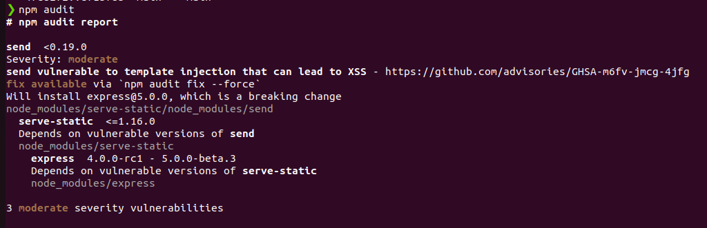
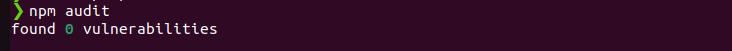
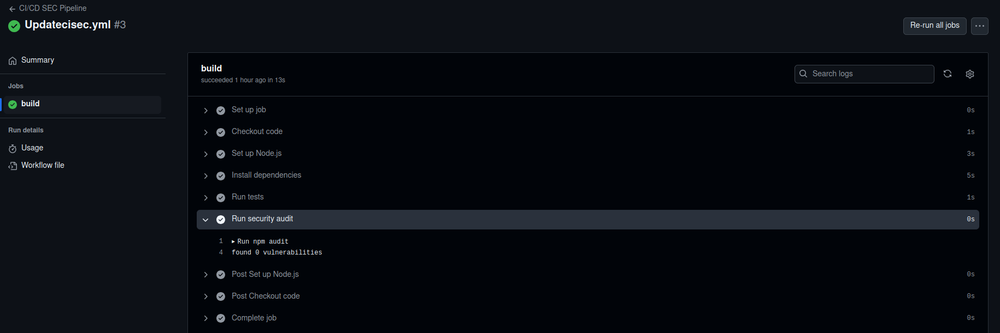
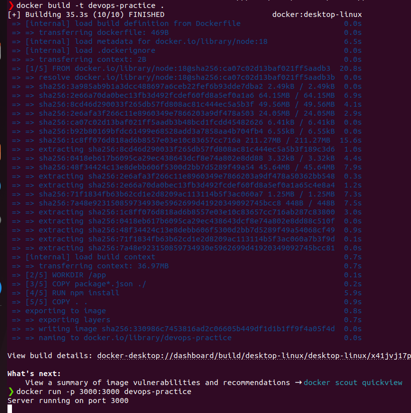
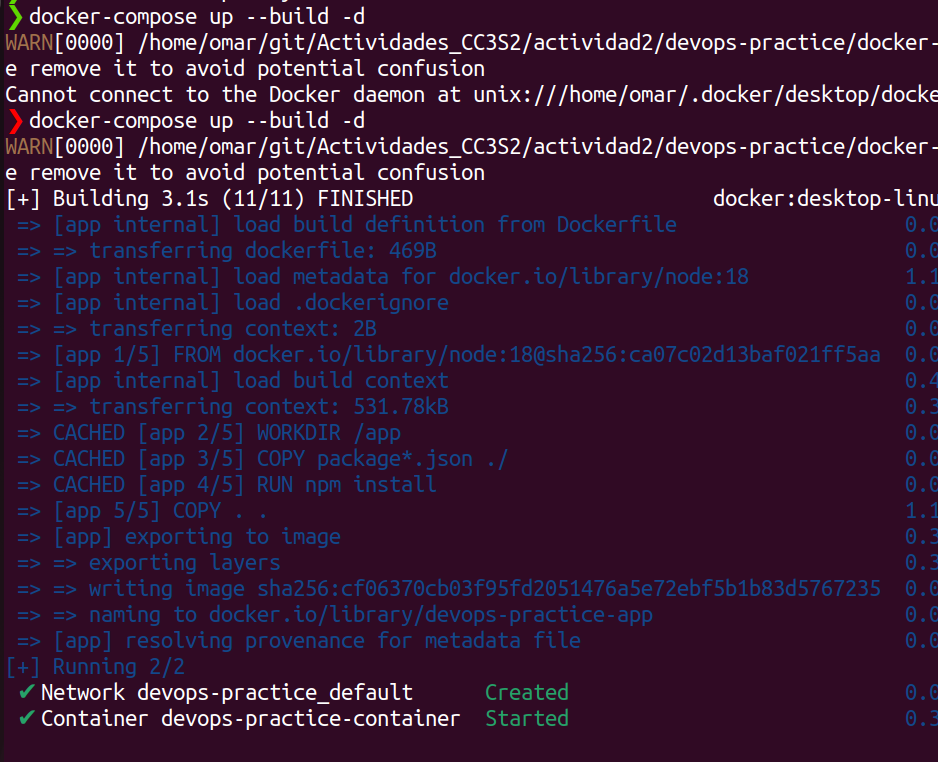

<h1>Documentacion de la actividad 2</h1>

<h2>Implementacion de DevSecops</h2>

Usamos una herramienta de seguridad de incluida en node usando el siguiente comando:
```shell
npm audit
```

Donde encontramos vulverabilidades en nuestro proyecto:



Para resolver estas vulverabilidades usamos

```shell
npm audit fix
```



<h3>Automatizacion del analisis de seguridad en GitHubAction</h3>

Agregamos el siguiente flujo de trabajo en un archivo llamado cisec.yml

```shell

name: CI/CD SEC Pipeline

on:
  push:
    branches:
      - main
  pull_request:
    branches:
      - main

jobs:
  build:
    runs-on: ubuntu-latest

    steps:
      - name: Checkout code
        uses: actions/checkout@v2

      - name: Set up Node.js
        uses: actions/setup-node@v2
        with:
          node-version: '20.11.1'

      - name: Install dependencies
        working-directory: ./actividad2/devops-practice/
        run: npm install

      - name: Run tests
        working-directory: ./actividad2/devops-practice/
        run: npm test

      - name: Run security audit
        working-directory: ./actividad2/devops-practice/
        run: npm audit

```

Y se observa que el codigo se despliegue con normalidad y no se ha encontrado vulnerabilidades.


<h3>Implementacion de Infraestructura como codigo</h3>
Creamos un archivo Dockerfile:

```shell

# Usa la imagen oficial de Node.js
FROM node:18

# Establece el directorio de trabajo en el contenedor
WORKDIR /app

# Copia los archivos package.json y package-lock.json
COPY package*.json ./

# Instala las dependencias
RUN npm install

# Copia el resto de los archivos de la aplicación
COPY . .

# Expone el puerto en el que la aplicación correrá
EXPOSE 3000

# Comando para iniciar la aplicación
CMD ["node", "src/app.js"]

```
Y  usamos los comandos:

```shell
docker build -t devops-practice .
docker run -p 3000:3000 devops-practice
```



</h3>Automatizacion de la gestion de contenedores usando Docker Compose</h3>

Creamos el archivo docker-compose.yml y dentro del archivo ponemos:

```shell
version: '3.8'
services:
  app:
    build: ./
    ports:
      - "3000:3000"
    environment:
      - NODE_ENV=production
    container_name: devops-practice-container
```

Ahora podemos iniciar los servicios definidos en el archivo docker-compose.yml usando el siguiente comando:

```shell
docker-compose up --build -d
```



<h3>Implementacion de observabilidad</h3>

Configuramos Prometheus y grafana para monitorear la aplicacion. 

Para ello primero creamos un archivo prometheus.yml

```shell

global:
  scrape_interval: 15s
  
scrape_configs:
  - job_name: 'node-app'
    static_configs:
      - targets: ['app:3000']

```

global: Esta es la seccion donde se definen las configuraciones globales de Prometheus. Las configuraciones aqui definidas se aplican a todas las tareas de extraccion de metricas(scrapeo).

scrape_interval:Le indica a prometheus que debe intentar obtener metricas de las aplicaciones y servicios cada cierto tiempo, en este caso 15 segundos.

scrape_configs: En esta seccion se configuran los trabajos de scraping

job_name: Es el nombre del trabajo de scrapping.

static_configs: Aqui se definen las configuraciones de destino estaticas, en otras palabras se indican manualmente las endpoints a los que prometheus debe conectarse para asi obtener las metricas


Posteriormente configuramos grafana utilizando un docker-compose.yml actualizado de la siguiente manera:

```shell

services:
  app:
    build: .
    ports:
      - "3000:3000"
    environment:
      - NODE_ENV=production
  prometheus:
    image: prom/prometheus
    volumes:
      - ./prometheus.yml:/etc/prometheus/prometheus.yml
    ports:
      - "9090:9090"
  grafana:
    image: grafana/grafana
    ports:
      - "3001:3000"

```


<h3>Conclusiones</h3>
En esta actividades implementamos DevSecOps usando una herramienta de analisis de seguridad estatica de node para encontrar vulnerabilidades. Ademas automatizamos el analisis de seguridad usando GitHubActions.Hacer esto desde el inicio del desarrollo web de un proyecyo es muy importante para asegurar la integridad del proyecto. Además es un ahorro significativo de dinero pues nos permite prevenir errores de seguridad que podrian ocurrir en el entorno de produccion, y recordar que un error en entorno de produccion es muy costoso de reparar.

