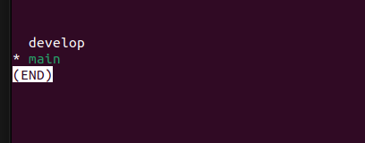
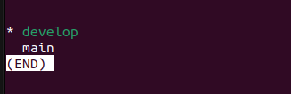
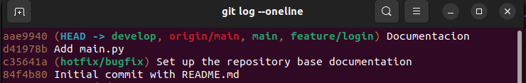
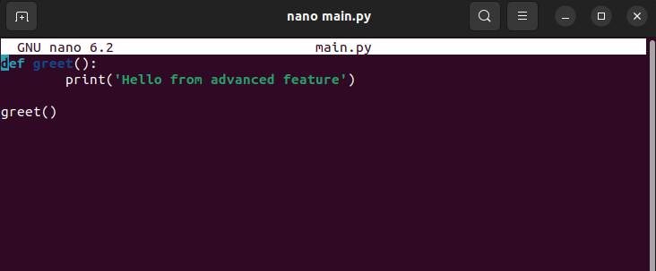
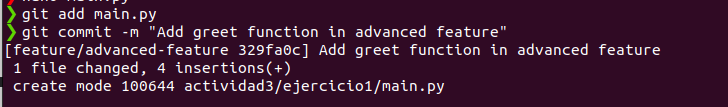
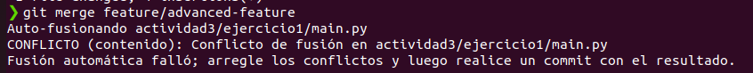
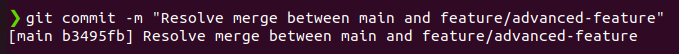

<h1>Introduccion a Git</h1>
<h2>Presentate a git</h2>
Ponemos nuestro nombre de usuario y correo:


Para ver el nuestro usuario y correo:


<h2>Creando un nuevo repositorio</h2>

Luego creamos un directorio usando el comando:

```shell

mkdir darknoon-repo

```

Dentro del directorio usamos git init para inicializar un nuevo repositorio: 

```shell

git init

```

<h2>Preparando el codigo</h2>

Luego de iniciar el repositorio creamos README.md

```shell

echo "README">README.md

```

Usamos el comando git status para observar el estado actual de nuestro repositorio:

```shell

git status

```

Donde observaremos que el archivo README.md esta de forma untracked, lo que quiere decir que aun no esta siendo rastreado por git.

Para hacer que git rastree este archivo usamos:  

```shell

git add README.md

```

Ahora si volvemos a usar el git status , nos saldra el mensaje que nuestro archivo esta siendo rastreado y esta listo para un commit.

Ahora para registrar nuestras modificaciones en el historial usaremos el comendo git commit:

```shell
git commit -m "Initial Commit"

```
Luego de la bandera -m sigue el mensaje del commit. Es buena practica que los mensajes de los commits sean claros y reflejen las modificaciones que se han hecho ya que ayuda a entender el historial.

Si volvemos a usar el comando git status nos dara el mensaje de no hay nada que comitear y que el workspace esta limpio.


Y ese es el ciclo de uso de git para guardar un archivo en tu repositorio.

<h2>Recorrer el arbol de commits</h2>
Para poder observar el historial de cambios de tu repositorio podemors usar el siguiente comando:

```shell

git log

```

Lo que nos mostrara una lista con todos los commits, cada commit tendra lo siguiente:

Un identificador SHA-1 unico, detalles del committer, marca de tiempo y el mensaje del commit.


Ademas del comando principal, hay una variedad de opciones que te permiten adaptar la salida a tus nececidades, algunos de estas opciones son:

```shell

git lop -p

git log --oneline

git log --graph

```

Por ejemplo tambien se puede mejorar la perspectica de la siguiente manera:

```shell

git log --graph --pretty=format:'%x09 %h %ar ("%an") %s'

```
--graph: Muestra un grafico de las ramas y fusiones , mostrandonos como estan relacionados

--pretty=format: Personaliza la salida de gti log para solo mostrar informacion especifica en un formato dado

%x09: Representa un tabulador, añade un espacio entre los diferentes elementos.

%h: Muestra el hash abreviado del commit

%ar: Muestra la fecha en que se hizo el commit

%an: Muestra el nombre del autor del commit entre parentesis.

%s: Muestra el mensaje del commit

Lo cual nos dara la siguiente salida:


<h2>Trabajar con branches</h2>

Hasta ahora hemos trabajo en git con un historial continuo , pero tambien se puede trabajar en un historial de entorno paralelo. Esto se logra al crear nuevas ramas(branches), donde podemos agregar nuevas caracteristicas al codigo o arreglar bugs sin afectar la base del codigo principal.

Para crear una nueva rama a partir de la rama actual se usa el siguiente comando:

```shell

git branch develop

```



Para cambiar a la nueva rama usamos el comando:

```shell

git checkout develop

```



Si queremos observar las ramas de nuestro repositorio, escribimos el siguiente comando:

```shell

git branch 

```

Ahora si queremos crear una rama desde una rama en especifico por ejemplo la rama develop usamos el siguiente comando:

```shell

git branch feature/login develop

```


Tambien podemos crear una nueva rama a partir de un commit especifico , para ello solo usamos el hash del commit desde donde queremos crear la rama

```shell

git branch hotfix/bugfix 'c35641a'

```



 <h2>Fusionando branches</h2>

 Primero vamos al branch donde deseamos fusionar las ramas y usamos el siguiente comando si quisieramos fusionarlo con la rama develop.

 ```shell

git merge develop

 ```

 Una vez fusionado la rama y que ya no sea necesaria, puede eliminarse usando el siguiente comando:

 ```shell

git branch -d develop

 ```

<h1>Ejercicios</h1>
 
<h2>Ejercicio1: Manejo avanzado de branches y resolucion de conflictos</h2>

Dentro de un directorio creamos un archivo main.py.

Luego creamos una rama llamada feature/advances-feature y luego cambiamos a esta rama:

```shell

git branch feature/advanced-feature

git checkout feature/advanced-feature

```

Luego creamos el archivo main.py y agregamos el siguiente codigo:



Añadimos y confirmamos estos cambios en la rama feature/advanced-feature.

```shell 

git add main.py

git commit -m "Add greet function in advanced feature"

```

  

Luego cambiamos a la rama main:

```shell
git checkout main
```

En la rama main pondremos el siguiente codigo en main.py:

```shell 
def greet():
    print('Hello Word-updated in main')

greet()

```
Añadimos y confirmamos estos cambios en la rama main:

```shell
git add main.py
git commit -m "Update main.py in main branch"

```

Cuando intentamos fusionar los cambios de la rama feature/advanced-feature y la rama main usando el comando:

```shell
git merge feature/advanced-feature
```

Nos saldra el siguiente mensaje:

  

Para resolver este conflicto debemos abrir el archivo y resolverlo manualmente

Luego de resolver el conflicto añadimos y confirmamos los cambios:

```shell 

git add main.py

git commit -m "Resolve merge conflict between main and feature/advanced-feature"

```

  

Finalmente eliminamos la rama feature/advanced-feature:

```shell

git branch -d feature/add-feature"

```

<h2>Ejercicio2: Exploración y manipulación del historial de commits</h2>


pick 1a2b3c4 "Add first-update"
squash 2b3c4d5 "Add-second-update"
squash 3c4d5e6 "Add-third-update"