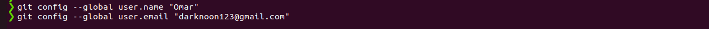
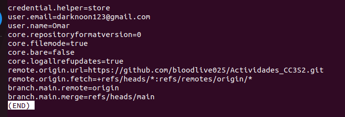
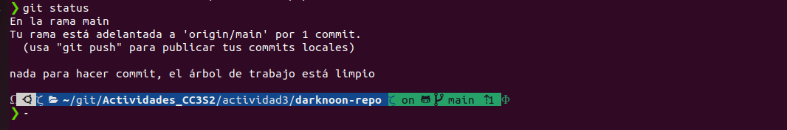
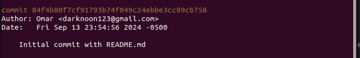
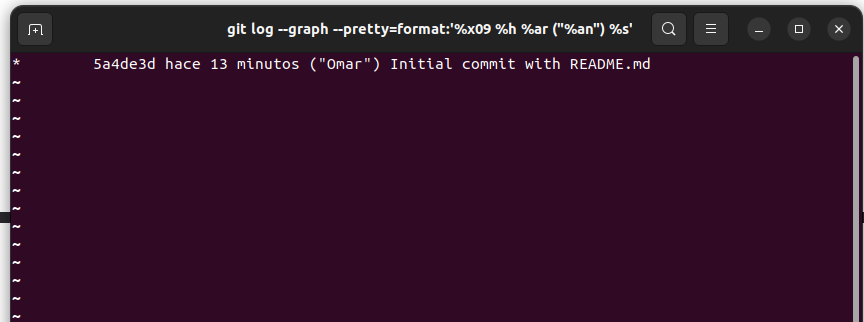

<h1>Introduccion a Git</h1>
<h2>Presentate a git</h2>
Ponemos nuestro nombre de usuario y correo:



Para ver el nuestro usuario y correo:



<h2>Creando un nuevo repositorio</h2>

Luego creamos un directorio usando el comando:

```shell

mkdir darknoon-repo

```

Dentro del directorio usamos git init para inicializar un nuevo repositorio: 

```shell

git init

```

<h2>Preparando el codigo</h2>

Luego de iniciar el repositorio creamos README.md

```shell

echo "README">README.md

```

Usamos el comando git status para observar el estado actual de nuestro repositorio:

```shell

git status

```

Donde observaremos que el archivo README.md esta de forma untracked, lo que quiere decir que aun no esta siendo rastreado por git.

Para hacer que git rastree este archivo usamos:  

```shell

git add README.md

```

Ahora si volvemos a usar el git status , nos saldra el mensaje que nuestro archivo esta siendo rastreado y esta listo para un commit.

Ahora para registrar nuestras modificaciones en el historial usaremos el comendo git commit:

```shell
git commit -m "Initial Commit"

```
Luego de la bandera -m sigue el mensaje del commit. Es buena practica que los mensajes de los commits sean claros y reflejen las modificaciones que se han hecho ya que ayuda a entender el historial.

Si volvemos a usar el comando git status nos dara el mensaje de no hay nada que comitear y que el workspace esta limpio.



Y ese es el ciclo de uso de git para guardar un archivo en tu repositorio.

<h2>Recorrer el arbol de commits</h2>
Para poder observar el historial de cambios de tu repositorio podemors usar el siguiente comando:

```shell

git log

```

Lo que nos mostrara una lista con todos los commits, cada commit tendra lo siguiente:

Un identificador SHA-1 unico, detalles del committer, marca de tiempo y el mensaje del commit.



Ademas del comando principal, hay una variedad de opciones que te permiten adaptar la salida a tus nececidades, algunos de estas opciones son:

```shell

git lop -p

git log --oneline

git log --graph

```

Por ejemplo tambien se puede mejorar la perspectica de la siguiente manera:

```shell

git log --graph --pretty=format:'%x09 %h %ar ("%an") %s'

```
--graph: Muestra un grafico de las ramas y fusiones , mostrandonos como estan relacionados

--pretty=format: Personaliza la salida de gti log para solo mostrar informacion especifica en un formato dado

%x09: Representa un tabulador, añade un espacio entre los diferentes elementos.

%h: Muestra el hash abreviado del commit

%ar: Muestra la fecha en que se hizo el commit

%an: Muestra el nombre del autor del commit entre parentesis.

%s: Muestra el mensaje del commit

Lo cual nos dara la siguiente salida:



<h2>Trabajar con branches</h2>


