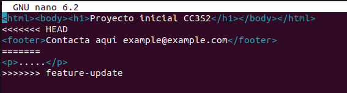

<h1>Ejercicios</h1>
<h2>Clona un repositorio Git con múltiples ramas</h2>

Tenemos el siguiente repositorio con dos ramas, la rama master y la rama feature/test.


La rama feature/test se creo a partir del commit 34d9a22. 


Se agrego dos commits en la rama feature/test para agregar los test. Como en la rama master no se ha creado ningun commit luego de crear la rama feature/test entonces es buena idea hacer un merge fast forward usando el siguiente comando.

```shell

git merge --ff feature/test

```


Si luego de crear una rama a partir de la rama principal se llegase a crear nuevos commits en la rama principal, entonces no se recomendaria usar fast forward.

<h2>Simula un flujo de trabajo de equipo</h2>
A partir de la rama master creamos dos ramas , una llamada feature/API y la otra feature/adddatabase. Donde en la primera rama crearemos el archivo api.py y en la segunda rama crearemos model.py.


Usaremos el siguente comando en la rama master para fusionar las ramas:

```shell

git merge --no-ff 

```

Una vez fusionadas las ramas , entonces el hisotorial de commits sera el siguiente:


La ventaja de usar el no-fast-forward es que se creara commit en cada fusion que hagamos, lo cual es importante para poder saber en que momento se creo se unio una rama. Y la deventaja de usar demasiados commits de fusion es que se creara un historial de commits muy complejo.

<h2>Crea múltiples commits en una rama</h2>

Crearemos una nueva rama llamada feature/feature1, donde haremos dos commits.


Ahora fusionaremos esta rama en la rama principal, pero ahora usando squash. Esto hara que a la hora de fusionar, los commits de feature/feature1, se aplastaran en 1 solo y este commit es el que aparecera en la rama master.


La fusion squash es importante cuando queramos disminuir el numero de commit es nuestro historial, para tener un historial mas limpio. Es buena idea usarlo cuando se han creado  muchos commits de pequeños cambios, y queramos unir todos estos commits en uno solo de cambio significativo.

<h2>Resolver conflictos en una fusión non-fast-forward</h2>

Crearemos un nuevo repositorio
```shell

mkdir try-merge-conflict
cd try-merge-conflict
git init

```

Luego añadimos un commit en el nuevo repositorio:

```shell

echo "<html><body><h1>Proyecto inicial CC3S2</h1></body></html>" > index.html
git add index.html
git commit -m "commit inicial del index.html en main"

```

Ahora creamos y cambiamos a la rama feature-update.

```shell

git checkout -b feature-update

```

Ahora editaremos el archivo index.html:

```shell 

echo "<p>.....</p>" >> index.html
git add index.html
git commit -m "Actualiza ..."


```
Cambiamos a la rama master y editamos el mismo archivo:

```shell

echo "<footer>Contacta aquí example@example.com</footer>" >> index.html
git add index.html
git commit -m "....index.html"

```

Fusionamos la rama feature-update en la rama master:

```shell

git merge --no-ff feature-update
```
Nos mostrara un error de conflicto, por lo que debemos de cambiarlo manualmente en el archivo donde ocurre los conflictos.



Una vez resuelto el conflicto añadiremos el archivo al stage y luego lo commitearemos. El nuevo historial es el siguiente:


<h3>Preguntas</h3>

Para solucionar los coflictos, tuve que usar el comando git status para saber en que archivos se encontraron los archivos, luego use el comando nano seguido del nombre del archivo para editarlo para finalmente usar git add y git commit para realizar el commit de fusion.

Para poder evitar conflictos en futuros desarrollos colaborativos, la comunicacion es esencial. Los trabajos deben ser repartidos de tal manera que se genere la minima cantidad de futuros conflictos posibles entre los colaboradores.

<h2>Comparar los historiales con git log después de diferentes fusiones</h2>